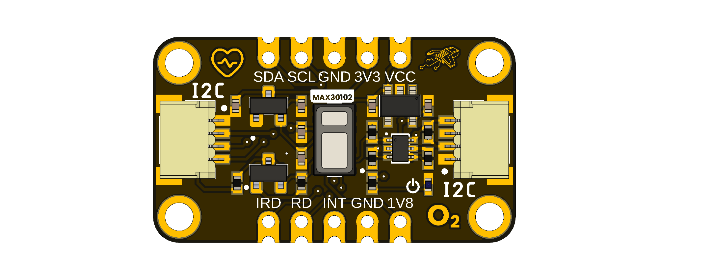

# DevLab: I2C MAX30102 Hearth Rate SPO2 Sensor

The UNIT DevLab I2C MAX30102 Hearth Rate SPO2 Sensor is a compact and efficient sensor designed for acquire 
measures of hearth rate, spo2 with multiple settings, the sensor counts with two power supply, for 1.8 V  and 3.3 V , for that energize many other boards of the Devlab ecosystem.

  
  
<em>Development Board</em>

### Quick Setup

## Overview

| Feature                                  | Specification                                                     |
|------------------------------------------|-------------------------------------------------------------------|
| Led Current Range                        | 0.0 to 51 mA                                                     |
| JST 1.0mm 4-Pin Port  | QWIIC-compatible I2C connector for easy sensor and module expansion |
| ADC Range Control                        | 2048 to 16384 |
| Sample Rate Control                      | 50,100,200,400,800,1000,1600,3200 sps       |
| Host Interface                           | I2C at up to 400 kHz                                               |
| Single Supply voltage                    | 5V ±10%                                                         |

## Applications

- **Prototyping:** Quickly develop and test ideas.
- **Education:** Suitable for learning to use practical sensors in your projects.
- **Wearables:** Compact and versatile for wearable devices.

## License

All hardware and documentation in this project are licensed under the **MIT License**.  
See [`LICENSE.md`](LICENSE.md) for details.

  Template created by UNIT Electronics

